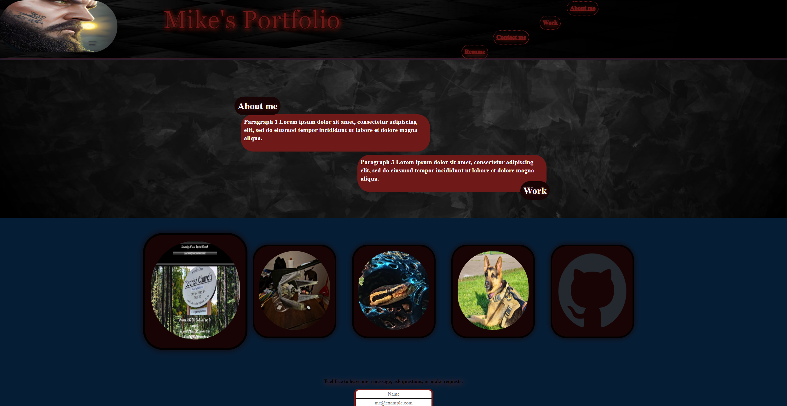

# Portfolio

## Description

This is my first attempt at making a Portfolio. Although I am lacking some projects to demonstrate and lack design skills; this gives me a good template.

## Usage

Use any of the "glowing" objects to move in the page or (when available) to the next page

## Credits

I did it all myself 🏆

## License

CC0-1.0

## Code Source

The code in this project is sourced from various tutorials, online resources, and personal implementations. 

## How to Contribute

Don't this is mine, but send your comments and I might work with you on something.

